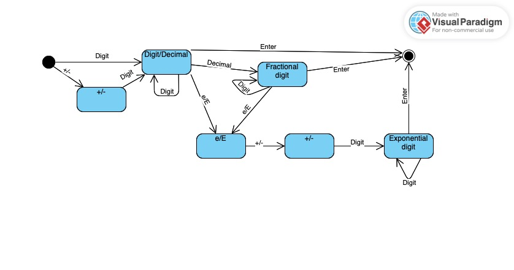
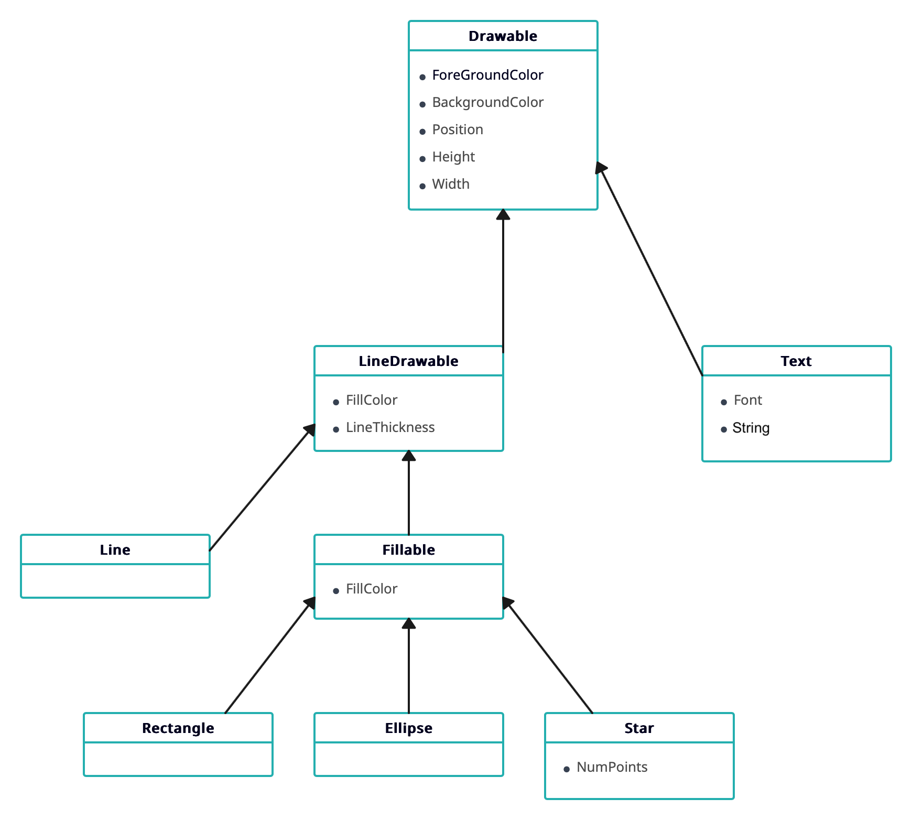

Aidan Dionisio and I worked together at a high-level for this assignment, although we each had our own individual documents.

5.1) Component-based architecture has multiple components that provide services for each other and communicate directly instead of across a network. A service-oriented architecture implements its pieces as self-contained programs that run on their own and provide some kind of service for their clients.

5.2) A monolithic architecture would be the most appropriate because the program doesn't need external components because the computer opponent doesn't need an external server to run on, and high scores are all stored on the phone already and won't require an external database. It would also be rule-based, because tic-tac-toe has game rules that include things like turn order, win conditions, and the limit of one symbol per box.

5.4) A client-server architecture would be the most appropriate because multiple users wouldn't need to use the same data, and it provides the ability to support multiple clients with the same system. It would be both event-driven and rule-based, because each player must wait to make their move until after the other player has taken their turn, and chess also has many game rules.

5.6) ClassyDraw doesn't necessarily need a database. Like many other editor programs, it should be able to read any files of its file type from the disk.
ClassyDraw should use an object storage database to store any in-progress drawings. An audit trail would also allow users to restore previous versions of a drawing.

5.8) 

6.1) All of the classes share the properties needed for drawing, for example, `ForegroundColor`, `BackgroundColor`, `Position`, `Width`, and `Height`.

The `Text` class will need properties to store the `Font` and the `String` data.

The `Star` class will need the number of points to draw, `NumPoints`.

The `Line`, `Rectangle`, `Ellipse`, and `Star` classes will all need the `LineThickness`, and `LineStyle` properties.

The `Rectangle`, `Ellipse`, and `Star` classes will all need the `FillColor` property.

6.2) 