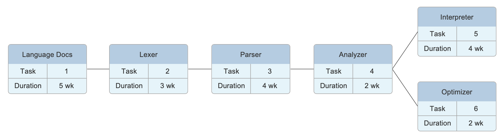

# Table of Contents

4.1 [Plan Introduction](#introduction)
 &emsp;&nbsp;&nbsp;&nbsp;4.1.1 [Project Deliverables](#deliverables)
 &emsp;&emsp;&emsp;&emsp;&nbsp;4.1.1.1 [Project Proposal Deliverable](#proposal)
 &emsp;&emsp;&emsp;&emsp;&nbsp;4.1.1.2 [Software Requirements Specification Deliverable](#srs)
 &emsp;&emsp;&emsp;&emsp;&nbsp;4.1.1.3 [Software Development Plan Deliverable](#sdp)
 &emsp;&emsp;&emsp;&emsp;&nbsp;4.1.1.4 [Project Demonstration](#demo)
 &emsp;&emsp;&emsp;&emsp;&nbsp;4.1.1.5 [Project Poster](#poster)
 &emsp;&emsp;&emsp;&emsp;&nbsp;4.1.1.6 [Final Product Delivery](#product)

4.2 [Project Resources](#resources)
 &emsp;&nbsp;&nbsp;&nbsp;4.2.1 [Hardware Resources](#hardware)
 &emsp;&nbsp;&nbsp;&nbsp;4.2.2 [Software Resources](#software)

4.3 [Project Organization](#organization)

4.4 [Project Schedule](#schedule)
 &emsp;&nbsp;&nbsp;&nbsp;4.4.1 [PERT Chart](#chart)
 &emsp;&nbsp;&nbsp;&nbsp;4.4.2 [Resource Table](#table)

---

# <a name="introduction" id="introduction"/> 4.1 Introduction

This Software Development Plan provides the details of the planned development for the programming language _Bang!_, which is a dynamically and weakly typed expression-based scripting language that prioritizes concise syntax and flexibility. _Bang!_ is an interpreted language, meaning it compiles and runs code in one step of the interpreter, rather than generating a runnable file after compilation. The language has no type errors, meaning that any operator has determined functionality for any combination of data types.

Because this is a continuing project, the lexer, parser, and language documentation are all completed. The development for this semester will include the optimizer (time permitting) and the interpreter. The interpreter shall be completed by the end of the semester and shall not throw any errors upon runtime. The optimizer is a stretch goal that will be implemented after the interpreter, as it only performs optimizations that shorten the runtime of the interpreter and is not necessary for the interpreter to function.

In addition to the implemented portions of the project, the project deliverables are as follows:

- 1/17: [Project Proposal](#proposal)
- 2/7: [Software Requirements Specification Draft](#srs)
- 2/21: [Software Development Plan Draft](#sdp)
- 3/27: [Software Development Plan](#sdp)
- 4/3: [Software Requirements Specification](#srs)
- 4/3: [Preliminary Project Demonstration](#demo)
- 4/10: [Preliminary Poster](#poster)
- 4/24: [Project Presentation](#poster)
- 4/24: [Final Product Delivery](#product)
- 4/24: [Final Report](#product)

## <a name="deliverables" id="deliverables"/> 4.1.1 Project Deliverables

For descriptions of the implemented portions of the project, see the [Project Organization](#organization). For the projected timeline, see the [Project Schedule](#schedule).

### <a name="proposal" id="proposal"/> 4.1.1.1 Project Proposal Deliverable

The [project proposal](./project-proposal.pdf) document contains a written description of the _Bang!_ programming language. It also includes a justification for the project, as well as potential ways to expand on the final product if time allows.

### <a name="srs" id="srs"/> 4.1.1.2 Software Requirements Specification Deliverable

The [software requirements specification](./software-requirements-specification.md) document specifies the requirements that must be fulfilled in the final product. It includes functional, performance, and environment requirements.

### <a name="sdp" id="sdp"/> 4.1.1.3 Software Development Plan Deliverable

This document is the software development plan document, which describes all of the project deliverables and software that will be implemented over the course of development. It includes the project's resources, organization, and expected timeline.

### <a name="demo" id="demo"/> 4.1.1.4 Project Demonstration

The project demonstration will make use of _Bang!_ scripts that have been written ahead of time. The presentation will include running the script from the command line and displaying the output, as well as talking through a simple example program that showcases some of the language highlights.

### <a name="poster" id="poster"/> 4.1.1.5 Project Poster

The final project presentation will rely on a poster that includes a high-level description of the final product, as well as the main components of the project. The poster will also depict some of the language highlights that differentiate _Bang!_ from other programming languages.

### <a name="product" id="product"/> 4.1.1.6 Final Product Delivery

The final product includes the completed [lexer](#lexer), [parser](#parser), [analyzer](#analyzer), and [interpreter](#interpreter). If time permits, the product will also include the [optimizer](#optimizer), which is not required for the interpreter to function completely.

The final deliverable also includes a final report, which consists of all the project documents covered previously in this section.

---

# <a name="resources" id="resources"/> 4.2 Project Resources

Because the development team for this project consists of only one person, there is no subdivision of labor. For the breakdown of specific tasks, see the [project schedule](#schedule).

## <a name="hardware" id="hardware"/> 4.2.1 Hardware Resources

For development purposes, there are no specific hardware requirements. Only one machine will be required, as there is no external server or database for this project.

For demonstration purposes, only one machine will be required, as no external server or database needs to be running in order to run _Bang!_ scripts.

## <a name="software" id="software"/> 4.2.2 Software Resources

This project will be developed using the [Visual Studio Code](https://code.visualstudio.com) text editor. No third party extensions from Visual Studio will be used. Any operating system would suffice for development purposes; however, due to the development team's current resources, macOS will be the main operating system.

For usage software requirements, see section 5.4 of the [software requirements specification](./software-requirements-specification.md).

---

# <a name="organization" id="organization"/> 4.3 Project Organization

This project is divided into five major components: the [lexer](#lexer), the [parser](#parser), the [analyzer](#analyzer), the [optimizer](#optimizer), and the [interpreter](#interpreter).

## <a name="lexer" id="lexer"/> 4.3.1 Lexer

The lexer uses regular expressions to group symbols (i.e. characters) into lists of tokens that can be passed to the [parser](#parser) (the next step of the interpreter). Because this is a continuing project, the lexer is already completed.

## <a name="parser" id="parser"/> 4.3.2 Parser

The parser groups the tokens passed from the [lexer](#lexer) into sentences and constructs the abstract syntax tree (AST) from the resulting sentences. The AST is then passed to the [analyzer](#analyzer). Because this is a continuing project, the parser is already completed.

## <a name="analyzer" id="analyzer"/> 4.3.3 Analyzer

The analyzer adds contextual meaning to the abstract syntax tree (AST) passed from the [parser](#parser). The analyzer uses a recursive descent algorithm, implemented in TypeScript, to dive through the AST. The decorated AST is then passed to the [optimizer](#optimizer).

## <a name="optimizer" id="optimizer"/> 4.3.4 Optimizer

The optimizer performs optimizations that decrease the overall runtime of the [interpreter](#interpreter). The basic optimizations that will be implemented, time permitting, will include loop unrolling, constant folding, and dead code removal. The optimizer will be implemented in TypeScript, using the same recursive descent algorithm as the [analyzer](#analyzer) to dive through the decorated AST.

## <a name="interpreter" id="interpreter"/> 4.3.5 Interpreter

The interpreter parses the optimized, decorated AST passed from the [optimizer](#optimizer) and prints any resulting output. The interpreter will be implemented in TypeScript, and will track the current output as it runs instructions.

---

# <a name="schedule" id="schedule"/> 4.4 Project Schedule

This section provides schedule information for the _Bang!_ programming language.

## <a name="chart" id="chart"/> 4.4.1 PERT Chart

The following chart depicts the expected timeline for the project development. Note that all tasks are assigned to the same developer, as the development team is composed of one developer only. For the same reason, there are also no meetings or conferences scheduled. Testing time is build into in the expected duration for each task.

Because the [optimizer](#optimizer) is not required for the project to function, the [interpreter](#interpreter) will be completed before beginning the implementation for the optimizer.

## <a name="table" id="table"/> 4.4.2 Resource Table

| Task                   | Developer | Hardware | Software                 |
| ---------------------- | --------- | -------- | ------------------------ |
| Language Documentation | Natalie   | Computer | VSCode, Yarn, TypeScript |
| Lexer                  | Natalie   | Computer | VSCode, Yarn, TypeScript |
| Parser                 | Natalie   | Computer | VSCode, Yarn, TypeScript |
| Analyzer               | Natalie   | Computer | VSCode, Yarn, TypeScript |
| Interpreter            | Natalie   | Computer | VSCode, Yarn, TypeScript |
| Optimizer              | Natalie   | Computer | VSCode, Yarn, TypeScript |