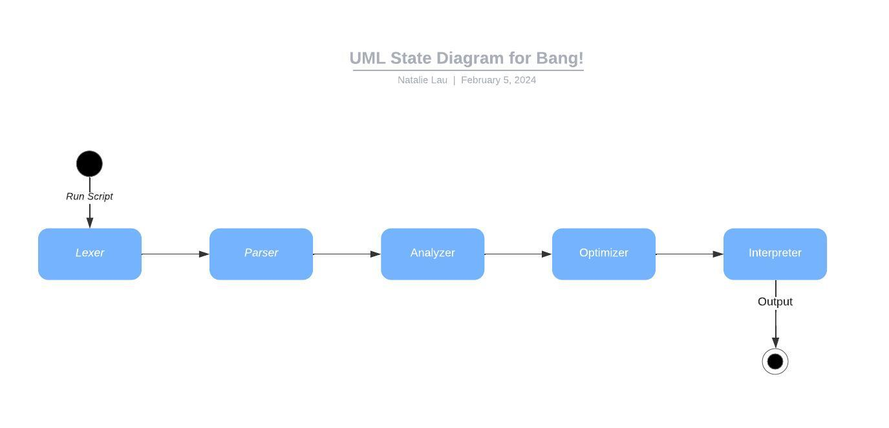

# Table of Contents
5.1 [Introduction](#introduction)

5.2 [Functional Requirements](#func-reqs)

# Requirements

##  5.1 Introduction
The programming language _Bang!_ is a dynamically and weakly typed expression-based scripting language that prioritizes concise syntax and flexibility. The language requires developers to have TypeScript, Yarn, and a text editor on their machine. The user can enter a command into their command line to run a script they write in _Bang!_. Language documentation is provided through Notion for developers' reference when writing scripts.

Below is a UML State Diagram depicting the order of the components in the interpreter.

The remainder of this document is structured as follows. [Section 5.2](#func-reqs) contains the functional requirements, which describe what the completed interpreter can be expected to have. [Section 5.3](#perform-reqs) contains the performance requirements, which include requirements regarding runtime. [Section 5.4](#env-reqs) contains the environment requirements, which lists any additional software requirements the user needs to have installed.

##  5.2 Functional Requirements
The interpreter for _Bang!_ is divided into a few components: the [lexer](#lexer), which groups symbols into tokens; the [parser](#parser), which groups tokens into sentences; the [analyzer](#analyzer), which adds contextual meaning to the abstract syntax tree; the [optimizer](#optimizer), which performs optimizations to decrease the interpreter's runtime; and the [interpreter](#interpreter), which runs the script and produces any necessary output.

###  5.2.1 Lexer
The lexer groups symbols (i.e. characters) into tokens that can be passed to the [parser](#parser) (the next step of the interpreter). The following requirements are levied on the lexer.

5.2.1.1 The lexer shall take a string as input to parse.

5.2.1.2 The lexer shall use regular expressions to group the input into tokens.

5.2.1.3 The lexer shall pass the resulting tokens to the parser as a list of tokens.

<!-- Describe features that completed system can be expected to have. Describe what completed system will do, but without describing how it will be accomplished. Each subsection should describe a single discrete functional requirement w/ a meaningful name.
All "shall" statements must be numbered.
No "will" or "should" statements should be numbered.
No "and" (that should be two statements).
"Will" and "should" statements MUST be associated with a requirement statement. The requirement statement should immediately precede the "will" or "should" statment in this case.
There can be more than one "will" or "should" statment associated with any "shall" statement.
When specifying performance requirements, be careful about specifying ranges of performance measures. They may come back to bite you in the end.
Try to write your requirements so they are testable statements.
Watch out for "weasel words" (ambiguous words) -->